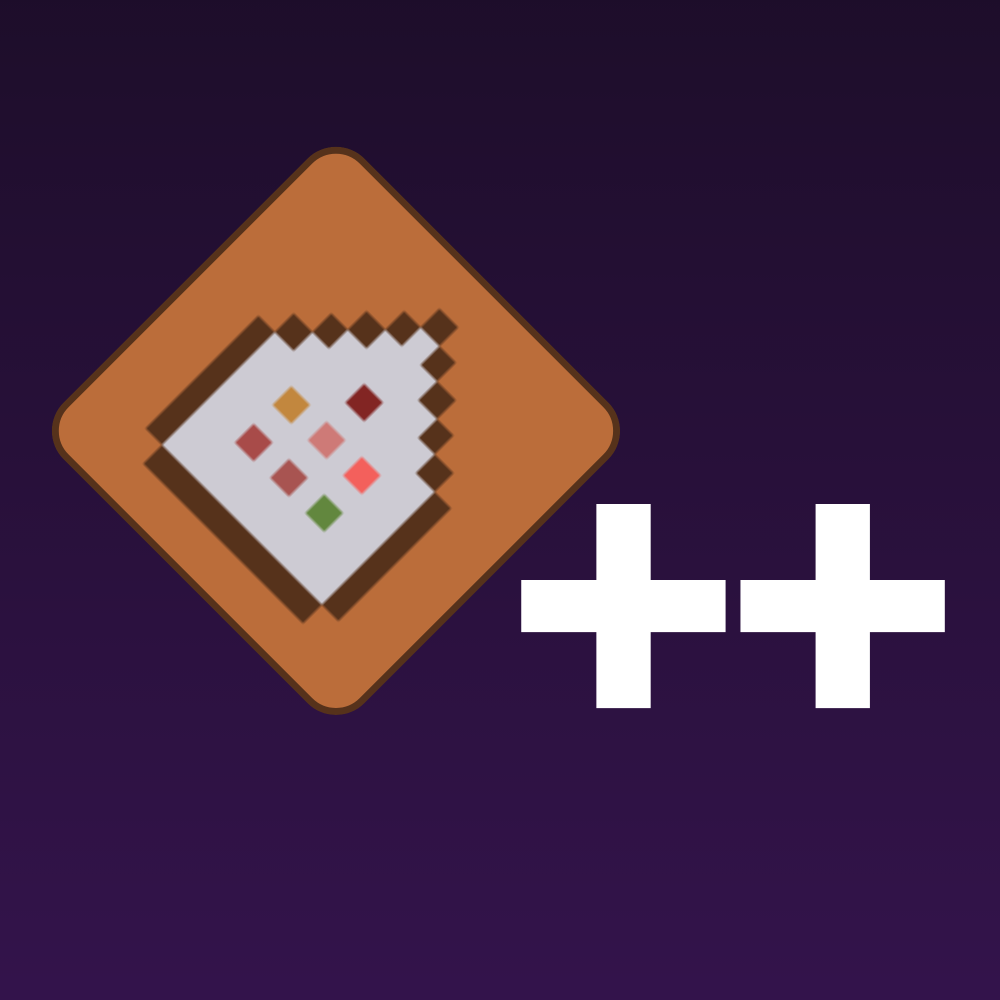

    

        <h1 style="margin-left: 20px">Commands Plus Plus</h1>
        <h4 style="margin-left: 20px">Minecraft Bedrock Command Extension Addon</h4>
    

    

 

## Welcome

MCBE Commands++ is a Minecraft Bedrock addon that extends the capabilities of vanilla commands. It allows you to use features from the Script API, opening up a whole new world of possibilities for your Minecraft experience.

## Wiki

Read more about the commands on our [wiki](https://jeanmajid.github.io/MCPE-Commands-plus-plus/) (Currently a WIP)

## License

This project is licensed under [GPL](https://github.com/jeanmajid/MCPE-Commands-plus-plus/blob/main/LICENSE).

    <h2>Contributors</h2>
  

