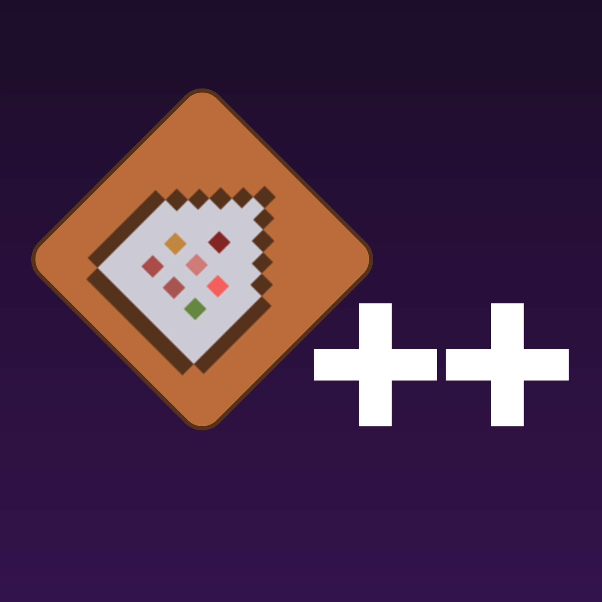

	<h1>
		Commands Plus Plus
	</h1>
	<h4>Minecraft Bedrock Command Extension Addon</h4>

 

# Welcome to The Commands++ Wiki

The wiki is here to help out on Commands++ usage, as some commands can be more complex. It will include information, usage examples and tips on how to improve perfomance

## Contributing

We welcome contributions. If you have a suggestion or found a bug, please open an issue on our [GitHub page](https://github.com/jeanmajid/MCBE-Commands-plus-plus/issues). If you know how to code you can gladly open a pull request. Full AI code is discouraged and will likely be denied

More info on how to run the wiki locally under the [wiki README.md](https://github.com/jeanmajid/MCPE-Commands-plus-plus/blob/5ded6e04abe24ab261ec50a36a4ebb52abff2cf1/wiki/README.md)
